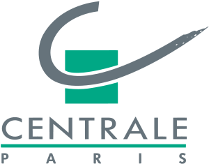

<h3>News</h3>
<ul>
	<li> NEW! Checkout our <a href="https://github.com/ramakrishnavedantam928/cider-matlab">code</a> and <a href="http://ramakrishnavedantam928.github.io/cider-matlab/">project page</a> for CIDEr, a new metric for image captioning systems.
	<li> Paper on "Adopting Abstract Images for Semantic Scene Understanding" accepted to IEEE TPAMI</li>
	<li> I am serving on the Program Committee for <a href='http://mile.ee.iisc.ernet.in/ICVGIP2014/'> ICVGIP 2014</a></li>
	<li> I interned at the <a href='http://cvn.ecp.fr/'>Center for Visual Computing</a> at Ecole Centrale de Paris/INRIA-Saclay in Summer, 2014 with Prof. Iasonas Kokkinos</li>
	<li> I won the Best Discussion Participant Award in the <a href='https://filebox.ece.vt.edu/~S14ECE5984/'>Advanced Topics in Computer Vision</a> course taught by Prof. Devi Parikh
	<li> I attended the <a href='http://svg.dmi.unict.it/icvss2014/'>International Computer Vision Summer School</a> (ICVSS), 2014</li>
	<li> I gave a talk at <a href='https://filebox.ece.vt.edu/~macv2014/'>Mid Atlantic Computer Vision Workshop</a> (MACV), 2014</li>
</ul>

Hi ! I am a masters student at Virginia Tech working under the guidance of <a href='http://filebox.ece.vt.edu/~parikh'>Prof. Devi Parikh</a> at the <a href='https://filebox.ece.vt.edu/~parikh/CVL.html'>Computer Vision Lab</a> (CVL). I am primarily interested in Computer Vision and Machine Learning.

My recent work focuses on Scene Understanding problems like Semantic Image Understanding and Face Detection. I work closely with <a href='http://research.microsoft.com/en-us/people/larryz/'>Dr. Larry Zitnick</a>, <a href='http://cvn.ecp.fr/personnel/iasonas/'> Prof. Iasonas Kokkinos</a> and<a href='https://filebox.ece.vt.edu/~dbatra/'> Prof. Dhruv Batra</a>. 

Previously I finished my undergrad in ECE at IIIT-Hyderabad where I worked with <a href='http://www.iiit.ac.in/people/faculty/mkrishna'>Prof. K. Madhava Krishna</a> on 3D reconstruction. <a href='https://sites.google.com/site/ramakrishnavedantam928/'>Here</a> is a link to my old website.

<b>I have spent several months at</b>

<table text-align="center"><tr><td>
	</td> <td></td><td></td><td></td><td></td></tr>
	<tr><td>2009-2013</td><td>2013-2015</td><td>Summer, 2012</td><td>Summer, 2014</td><td>Summer, 2014</td></tr>
</table>

If you like this layout/page, see <a href='demo-post'> this</a> to build your own using github+jekyll 

